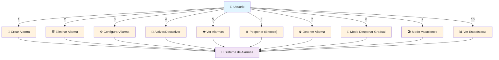
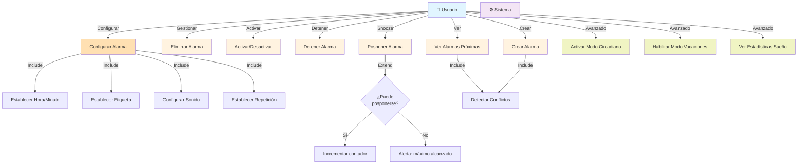

# Diagrama de Casos de Uso UML

## Diagrama de Casos de Uso - Sistema de Alarmas Inteligentes



## Diagrama Detallado con Include/Extend



---

## Especificación de Casos de Uso

### 📝 **CU-001: Crear Alarma**

| Atributo | Descripción |
|----------|-------------|
| **Nombre** | Crear Alarma |
| **Objetivo** | Permitir al usuario crear una nueva alarma con configuración inicial |
| **Actor Principal** | Usuario |
| **Precondiciones** | • El sistema está en funcionamiento<br>• El usuario tiene capacidad de crear alarmas |
| **Flujo Principal** | 1. El usuario solicita crear una nueva alarma<br>2. El sistema inicializa una alarma con valores por defecto<br>3. El usuario establece hora (0-23) y minuto (0-59)<br>4. El usuario establece una etiqueta descriptiva<br>5. El usuario configura sonido y volumen<br>6. El usuario establece patrón de repetición<br>7. El usuario confirma la creación<br>8. El sistema valida los datos<br>9. El sistema genera un ID único<br>10. El sistema almacena la alarma<br>11. El sistema muestra confirmación |
| **Flujos Alternativos** | **FA-1**: Datos inválidos<br>- Si algún dato no es válido (ej: hora > 23)<br>- El sistema muestra error específico<br>- El usuario corrige los datos<br>- Continúa en paso 8<br><br>**FA-2**: Cancelar creación<br>- El usuario cancela en cualquier momento<br>- El sistema descarta los cambios |
| **Postcondiciones** | • Nueva alarma creada con estado inactivo<br>• Alarma almacenada en el gestor<br>• ID único asignado<br>• Usuario recibe confirmación |
| **Reglas de Negocio** | RN-1: Hora debe estar entre 0-23<br>RN-2: Minuto debe estar entre 0-59<br>RN-3: Etiqueta no puede estar vacía<br>RN-4: Volumen entre 0-100<br>RN-5: Cada alarma tiene ID único e irrepetible |

---

### 🗑️ **CU-002: Eliminar Alarma**

| Atributo | Descripción |
|----------|-------------|
| **Nombre** | Eliminar Alarma |
| **Objetivo** | Permitir al usuario eliminar una alarma existente |
| **Actor Principal** | Usuario |
| **Precondiciones** | • La alarma existe en el sistema<br>• El usuario tiene permisos para eliminar |
| **Flujo Principal** | 1. El usuario selecciona una alarma existente<br>2. El usuario solicita eliminar<br>3. El sistema solicita confirmación<br>4. El usuario confirma<br>5. El sistema elimina la alarma<br>6. El sistema muestra confirmación |
| **Flujos Alternativos** | **FA-1**: Usuario cancela<br>- El usuario niega la confirmación<br>- El sistema cancela operación |
| **Postcondiciones** | • Alarma eliminada del sistema<br>• ID liberado para reutilización (no recomendado)<br>• Estadísticas actualizadas si aplica |
| **Reglas de Negocio** | RN-1: No se pueden recuperar alarmas eliminadas<br>RN-2: Si está activa, se desactiva primero |

---

### ⚙️ **CU-003: Configurar Alarma**

| Atributo | Descripción |
|----------|-------------|
| **Nombre** | Configurar Alarma |
| **Objetivo** | Permitir modificar los parámetros de una alarma existente |
| **Actor Principal** | Usuario |
| **Precondiciones** | • La alarma existe en el sistema<br>• El usuario está editando la alarma |
| **Flujo Principal** | 1. El usuario selecciona una alarma<br>2. El sistema muestra formulario de edición<br>3. El usuario modifica hora (si lo desea)<br>4. El usuario modifica minuto (si lo desea)<br>5. El usuario modifica etiqueta (si lo desea)<br>6. El usuario modifica sonido (si lo desea)<br>7. El usuario modifica volumen (si lo desea)<br>8. El usuario modifica patrón repetición (si lo desea)<br>9. El usuario confirma cambios<br>10. El sistema valida datos<br>11. El sistema actualiza alarma |
| **Flujos Alternativos** | **FA-1**: Datos inválidos en edición<br>- El sistema rechaza cambio y notifica error<br>- El usuario corrige<br>- Continúa validación |
| **Postcondiciones** | • Alarma actualizada con nuevos valores<br>• Si estaba activa, sigue activa (o se reactiva)<br>• Cambios persistidos |
| **Reglas de Negocio** | RN-1: Las validaciones son idénticas a crear alarma<br>RN-2: No se puede cambiar el ID |

---

### 🔄 **CU-004: Activar/Desactivar Alarma**

| Atributo | Descripción |
|----------|-------------|
| **Nombre** | Activar/Desactivar Alarma |
| **Objetivo** | Permitir al usuario cambiar el estado de una alarma |
| **Actor Principal** | Usuario |
| **Precondiciones** | • La alarma existe en el sistema |
| **Flujo Principal** | 1. El usuario selecciona una alarma<br>2. El usuario solicita cambiar estado<br>3. El sistema valida cambio de estado<br>4. El sistema actualiza isActive<br>5. El sistema notifica cambio |
| **Flujos Alternativos** | **FA-1**: En modo Vacaciones<br>- Si Modo Vacaciones está activo<br>- El sistema impide activación<br>- Muestra mensaje informativo |
| **Postcondiciones** | • Estado de alarma modificado<br>• Si ahora está activa, aparece en "próximas alarmas"<br>• Si está inactiva, desaparece de próximas alarmas |
| **Reglas de Negocio** | RN-1: En Modo Vacaciones todas las alarmas están desactivadas<br>RN-2: Al reactivar fuera de Modo Vacaciones, recupera estado anterior |

---

### 👁️ **CU-005: Ver Alarmas Próximas**

| Atributo | Descripción |
|----------|-------------|
| **Nombre** | Ver Alarmas Próximas |
| **Objetivo** | Mostrar al usuario las próximas alarmas que van a sonar |
| **Actor Principal** | Usuario |
| **Precondiciones** | • Sistema en funcionamiento<br>• Al menos una alarma activa |
| **Flujo Principal** | 1. El usuario solicita ver próximas alarmas<br>2. El sistema calcula próximas alarmas activas<br>3. El sistema ordena por hora más cercana<br>4. El sistema detecta conflictos (CU-010)<br>5. El sistema muestra lista de próximas alarmas<br>6. Para cada alarma muestra:<br>&nbsp;&nbsp;&nbsp;&nbsp;- Hora/minuto<br>&nbsp;&nbsp;&nbsp;&nbsp;- Etiqueta<br>&nbsp;&nbsp;&nbsp;&nbsp;- Patrón de repetición<br>&nbsp;&nbsp;&nbsp;&nbsp;- Indicador de conflicto (si aplica) |
| **Flujos Alternativos** | **FA-1**: No hay alarmas activas<br>- El sistema muestra mensaje informativo<br>- "No hay alarmas activas" |
| **Postcondiciones** | • Usuario ve lista de próximas alarmas<br>• Se muestran conflictos si existen<br>• Información actualizada |
| **Reglas de Negocio** | RN-1: Solo muestra alarmas activas<br>RN-2: Orden por hora más cercana<br>RN-3: En Modo Vacaciones, lista vacía |

---

### ⏸️ **CU-006: Posponer Alarma (Snooze)**

| Atributo | Descripción |
|----------|-------------|
| **Nombre** | Posponer Alarma (Snooze) |
| **Objetivo** | Permitir al usuario posponer una alarma que está sonando |
| **Actor Principal** | Usuario |
| **Precondiciones** | • Una alarma está sonando<br>• Configuración de snooze permite postponimiento |
| **Flujo Principal** | 1. El usuario presiona botón Snooze<br>2. El sistema verifica max snoozes permitidos<br>3. El usuario puede posponer? (RN-2)<br>4. Si SÍ:<br>&nbsp;&nbsp;&nbsp;&nbsp;a. El sistema calcula nuevo tiempo (actual + intervalo snooze)<br>&nbsp;&nbsp;&nbsp;&nbsp;b. El sistema incrementa contador snooze<br>&nbsp;&nbsp;&nbsp;&nbsp;c. El sistema agenda nueva activación<br>&nbsp;&nbsp;&nbsp;&nbsp;d. Alarma se detiene temporalmente<br>&nbsp;&nbsp;&nbsp;&nbsp;e. Sistema notifica al usuario del próximo sonar<br>5. Si NO:<br>&nbsp;&nbsp;&nbsp;&nbsp;a. Sistema notifica "máximo de snoozes alcanzado"<br>&nbsp;&nbsp;&nbsp;&nbsp;b. Usuario debe detener alarma |
| **Flujos Alternativos** | **FA-1**: Snooze no configurado<br>- El sistema deshabilita snooze<br>- Muestra "Snooze no disponible" |
| **Postcondiciones** | • Alarma pospuesta N minutos<br>• Contador de snooze incrementado<br>• Nueva activación programada<br>• Estadística de snooze registrada |
| **Reglas de Negocio** | RN-1: Intervalo snooze por defecto: 10 minutos<br>RN-2: Máximo snoozes permitidos: 5 veces<br>RN-3: Cada snooze se registra en estadísticas |

---

### ⛔ **CU-007: Detener Alarma**

| Atributo | Descripción |
|----------|-------------|
| **Nombre** | Detener Alarma |
| **Objetivo** | Permitir al usuario detener una alarma que está sonando |
| **Actor Principal** | Usuario |
| **Precondiciones** | • Una alarma está sonando |
| **Flujo Principal** | 1. El usuario presiona botón Detener/Apagar<br>2. El sistema detiene el sonido<br>3. El sistema detiene el proceso de snooze<br>4. El sistema registra tiempo de despertar<br>5. El sistema registra en estadísticas<br>6. Alarma vuelve a estado inactivo (o espera próxima repetición) |
| **Flujos Alternativos** | **FA-1**: Alarma con reto matemático<br>- El usuario debe resolver reto primero<br>- Si resuelve, se detiene<br>- Si no, sigue sonando |
| **Postcondiciones** | • Alarma detenida<br>• Tiempo de despertar registrado<br>• Estadísticas actualizadas<br>• Sonido y vibración desactivados |
| **Reglas de Negocio** | RN-1: No se puede ignorar, requiere acción activa<br>RN-2: Si es repetida, espera próxima instancia |

---

### 🌅 **CU-008: Activar Modo Despertar Circadiano**

| Atributo | Descripción |
|----------|-------------|
| **Nombre** | Activar Modo Despertar Circadiano |
| **Objetivo** | Permitir al usuario configurar despertar gradual progresivo |
| **Actor Principal** | Usuario |
| **Precondiciones** | • Al menos una alarma existe<br>• Sistema soporta despertar circadiano |
| **Flujo Principal** | 1. El usuario accede a configuración avanzada<br>2. El usuario selecciona "Despertar Circadiano"<br>3. El usuario configura:<br>&nbsp;&nbsp;&nbsp;&nbsp;a. Duración total (ej: 30 minutos)<br>&nbsp;&nbsp;&nbsp;&nbsp;b. Volumen inicial (ej: 10%)<br>&nbsp;&nbsp;&nbsp;&nbsp;c. Volumen final (ej: 100%)<br>&nbsp;&nbsp;&nbsp;&nbsp;d. Brillo inicial (ej: 0%)<br>&nbsp;&nbsp;&nbsp;&nbsp;e. Brillo final (ej: 100%)<br>&nbsp;&nbsp;&nbsp;&nbsp;f. Sonido (naturaleza, clásico, etc.)<br>4. El usuario confirma configuración<br>5. El sistema activa CircadianMode para alarmas seleccionadas<br>6. Próxima alarma aplicará despertar gradual |
| **Flujos Alternativos** | **FA-1**: Configuración inválida<br>- Validar rangos (0-100 para volumen/brillo)<br>- Validar duración > 0 |
| **Postcondiciones** | • CircadianMode activado<br>• Próximas alarmas aplicarán despertar gradual<br>• Volumen y brillo aumentarán progresivamente |
| **Reglas de Negocio** | RN-1: Duración entre 5-60 minutos<br>RN-2: Volumen/brillo entre 0-100<br>RN-3: Se aplica a todas las alarmas a menos que se especifique |

---

### 🏖️ **CU-009: Habilitar Modo Vacaciones**

| Atributo | Descripción |
|----------|-------------|
| **Nombre** | Habilitar Modo Vacaciones |
| **Objetivo** | Desactivar temporalmente todas las alarmas durante periodo de vacaciones |
| **Actor Principal** | Usuario |
| **Precondiciones** | • Sistema en funcionamiento |
| **Flujo Principal** | 1. El usuario accede a configuración avanzada<br>2. El usuario selecciona "Modo Vacaciones"<br>3. El usuario establece fecha inicio<br>4. El usuario establece fecha fin<br>5. El usuario confirma<br>6. El sistema activa VacationMode<br>7. El sistema desactiva todas las alarmas activas<br>8. El sistema almacena IDs de alarmas desactivadas<br>9. El usuario recibe confirmación |
| **Flujos Alternativos** | **FA-1**: Rango de fechas inválido<br>- Fin debe ser después de inicio<br>- Error y pedido de corrección |
| **Postcondiciones** | • VacationMode activado<br>• Todas las alarmas desactivadas temporalmente<br>• Almacenadas para recuperar al finalizar<br>• No se pueden activar alarmas durante este período |
| **Reglas de Negocio** | RN-1: Rango de fechas válido<br>RN-2: Se puede deshabilitar antes de fecha fin<br>RN-3: Al finalizar, se restauran estados previos |

---

### 📊 **CU-010: Ver Estadísticas de Sueño**

| Atributo | Descripción |
|----------|-------------|
| **Nombre** | Ver Estadísticas de Sueño |
| **Objetivo** | Mostrar al usuario datos sobre sus hábitos de sueño |
| **Actor Principal** | Usuario |
| **Precondiciones** | • Sistema registra datos de sueño |
| **Flujo Principal** | 1. El usuario solicita ver estadísticas<br>2. El sistema calcula:<br>&nbsp;&nbsp;&nbsp;&nbsp;a. Promedio de horas dormidas<br>&nbsp;&nbsp;&nbsp;&nbsp;b. Total de veces pospuestas (snoozes)<br>&nbsp;&nbsp;&nbsp;&nbsp;c. Calidad de sueño (0-100)<br>&nbsp;&nbsp;&nbsp;&nbsp;d. Datos de última semana<br>&nbsp;&nbsp;&nbsp;&nbsp;e. Puntualidad al levantarse<br>3. El sistema genera reporte<br>4. Sistema muestra reporte al usuario |
| **Flujos Alternativos** | **FA-1**: No hay datos suficientes<br>- Si menos de 7 días de datos<br>- Sistema muestra datos parciales |
| **Postcondiciones** | • Reporte generado<br>• Usuario visualiza estadísticas<br>• Datos históricos conservados |
| **Reglas de Negocio** | RN-1: Cálculo de calidad: basado en regularidad y horas dormidas<br>RN-2: Se conservan datos últimos 30 días |

---

### 🔍 **CU-011: Detectar Conflictos entre Alarmas**

| Atributo | Descripción |
|----------|-------------|
| **Nombre** | Detectar Conflictos entre Alarmas |
| **Objetivo** | Alertar al usuario cuando dos alarmas están demasiado cercanas |
| **Actor Principal** | Sistema (automático) |
| **Precondiciones** | • Al menos 2 alarmas activas en horario similar |
| **Flujo Principal** | 1. El usuario crea/modifica una alarma<br>2. El sistema ejecuta AlarmConflictDetector<br>3. Se compara con todas las alarmas activas<br>4. Se calcula diferencia de tiempo<br>5. Si diferencia < threshold (5 minutos):<br>&nbsp;&nbsp;&nbsp;&nbsp;a. Conflicto detectado<br>&nbsp;&nbsp;&nbsp;&nbsp;b. Sistema notifica al usuario<br>&nbsp;&nbsp;&nbsp;&nbsp;c. Muestra pares en conflicto<br>&nbsp;&nbsp;&nbsp;&nbsp;d. Sugiere cambiar una de ellas<br>6. Si diferencia >= threshold:<br>&nbsp;&nbsp;&nbsp;&nbsp;a. Sin conflicto, operación continúa |
| **Flujos Alternativos** | **FA-1**: Usuario ignora advertencia<br>- Se permite la creación/modificación<br>- Se registra el conflicto |
| **Postcondiciones** | • Usuario informado de conflictos<br>• Alarma creada/modificada a pesar del conflicto (decisión del usuario)<br>• Conflicto registrado en el sistema |
| **Reglas de Negocio** | RN-1: Threshold por defecto: 5 minutos<br>RN-2: Solo compara en mismo día de la semana<br>RN-3: Usuario puede ignorar advertencia |

---

## Relaciones entre Casos de Uso

```
                           ┌─ CU-003 (Configurar)
                           │
CU-001 (Crear) ────────────┼─ CU-011 (Detectar Conflictos)
                           │
                           └─ CU-005 (Ver Próximas)

CU-004 (Activar/Desactivar) ←─┬─ CU-009 (Modo Vacaciones)
                               │
                               └─ CU-002 (Eliminar)

CU-006 (Snooze) ────┬─ CU-010 (Estadísticas)
                    │
CU-007 (Detener) ───┴─ CU-010 (Estadísticas)

CU-008 (Circadiano) ──→ Configuración de alarmas
```

