# Diagrama UML de Clases

## Diagrama Completo - Sistema de Alarmas Inteligentes

```mermaid
classDiagram
    class Alarm {
        -id: String
        -hour: int
        -minute: int
        -label: String
        -isActive: boolean
        -soundProfile: SoundProfile
        -recurrencePattern: RecurrencePattern
        -snoozeConfig: SnoozeConfig
        +getId() String
        +getHour() int
        +getMinute() int
        +setHour(int) void
        +setMinute(int) void
        +setLabel(String) void
        +isActive() boolean
        +activate() void
        +deactivate() void
        +updateSoundProfile(SoundProfile) void
        +updateRecurrence(RecurrencePattern) void
    }

    class SoundProfile {
        -soundType: String
        -volume: int
        -isVibrationEnabled: boolean
        +getSoundType() String
        +setSoundType(String) void
        +getVolume() int
        +setVolume(int) void
        +isVibrationEnabled() boolean
        +setVibration(boolean) void
    }

    class RecurrencePattern {
        -daysOfWeek: Set~DayOfWeek~
        -isOneTime: boolean
        +addDay(DayOfWeek) void
        +removeDay(DayOfWeek) void
        +setWeekdays() void
        +setWeekend() void
        +setAllDays() void
        +shouldActivateOn(DayOfWeek) boolean
        +isOneTime() boolean
    }

    class SnoozeConfig {
        -snoozeIntervalMinutes: int
        -maxSnoozeCount: int
        -currentSnoozeCount: int
        +getSnoozeInterval() int
        +setSnoozeInterval(int) void
        +getMaxSnoozeCount() int
        +canSnooze() boolean
        +incrementSnooze() void
        +resetSnooze() void
    }

    class AlarmManager {
        -alarms: List~Alarm~
        -snoozeManager: SnoozeManager
        -circadianMode: CircadianMode
        -vacationMode: VacationMode
        -conflictDetector: AlarmConflictDetector
        -sleepStatistics: SleepStatistics
        +createAlarm(int, int, String) Alarm
        +deleteAlarm(String) boolean
        +getAlarmById(String) Alarm
        +getAllAlarms() List~Alarm~
        +getActiveAlarms() List~Alarm~
        +getNextActiveAlarms(int) List~Alarm~
        +enableAlarm(String) void
        +disableAlarm(String) void
        +updateAlarm(Alarm) void
        +checkAlarmsDue() List~Alarm~
    }

    class SnoozeManager {
        -snoozedAlarms: Map~String,LocalDateTime~
        +snoozeAlarm(String) LocalDateTime
        +isAlarmSnoozed(String) boolean
        +getSnoozeTime(String) LocalDateTime
        +resetSnooze(String) void
        +clearExpiredSnoozes() void
    }

    class CircadianMode {
        -durationMinutes: int
        -initialVolume: int
        -finalVolume: int
        -initialBrightness: int
        -finalBrightness: int
        +startCircadianWakeup(Alarm) void
        +getCurrentVolume(long) int
        +getCurrentBrightness(long) int
        +getProgressPercentage(long) double
    }

    class VacationMode {
        -isEnabled: boolean
        -startDate: LocalDate
        -endDate: LocalDate
        -deactivatedAlarms: List~String~
        +enable(LocalDate, LocalDate) void
        +disable() void
        +isActive() boolean
        +isWithinVacation(LocalDate) boolean
    }

    class AlarmConflictDetector {
        -conflictThresholdMinutes: int
        +detectConflicts(List~Alarm~) List~Conflict~
        +hasConflict(Alarm, Alarm) boolean
        +getConflictingAlarms(String) List~Alarm~
        +setThreshold(int) void
    }

    class SleepStatistics {
        -sleepRecords: List~SleepRecord~
        -totalSnoozes: int
        -averageSnoozeTime: double
        +recordSleep(LocalDateTime, LocalDateTime) void
        +recordSnooze(String, long) void
        +getAverageSleepHours() double
        +getTotalSnoozes() int
        +getSleepQualityScore() int
        +getStatistics() SleepStatisticsReport
    }

    class SleepRecord {
        -bedTime: LocalDateTime
        -wakeUpTime: LocalDateTime
        -duration: Duration
        +getDuration() Duration
    }

    class Conflict {
        -alarm1Id: String
        -alarm2Id: String
        -timeDifferenceMinutes: int
        +getAlarm1Id() String
        +getAlarm2Id() String
        +getTimeDifference() int
    }

    class SleepStatisticsReport {
        -averageSleepHours: double
        -totalSnoozes: int
        -sleepQuality: int
        -lastWeekData: List~SleepRecord~
        +getReport() String
    }

    %% Relaciones
    AlarmManager "1" *-- "0..*" Alarm: manages
    AlarmManager "1" *-- "1" SnoozeManager: uses
    AlarmManager "1" *-- "1" CircadianMode: uses
    AlarmManager "1" *-- "1" VacationMode: uses
    AlarmManager "1" *-- "1" AlarmConflictDetector: uses
    AlarmManager "1" *-- "1" SleepStatistics: uses

    Alarm "1" *-- "1" SoundProfile: has
    Alarm "1" *-- "1" RecurrencePattern: has
    Alarm "1" *-- "1" SnoozeConfig: has

    SleepStatistics "1" *-- "0..*" SleepRecord: contains
    SleepStatistics "1" *-- "1" SleepStatisticsReport: generates

    AlarmConflictDetector "1" *-- "0..*" Conflict: detects

    %% Estilos
    style Alarm fill:#ffcccc
    style AlarmManager fill:#ccccff
    style SnoozeManager fill:#ccffcc
    style CircadianMode fill:#ffffcc
    style VacationMode fill:#ffccff
```



## Explicación de Relaciones

### Composición (vinculación fuerte)
- **AlarmManager ◆ Alarm**: El AlarmManager gestiona un conjunto de alarmas. Si se destruye AlarmManager, se destruyen las alarmas.
- **Alarm ◆ SoundProfile, RecurrencePattern, SnoozeConfig**: Cada alarma tiene exactamente una configuración de sonido, patrón de repetición y snooze. Son parte integral de la alarma.
- **SleepStatistics ◆ SleepRecord**: Los registros de sueño pertenecen única y exclusivamente a SleepStatistics.

### Agregación (vinculación débil)
- **AlarmManager → SnoozeManager, CircadianMode, etc.**: El AlarmManager usa estos componentes, pero pueden existir independientemente.

---

## Justificación de Visibilidad

| Atributo/Método | Visibilidad | Razón |
|-----------------|------------|-------|
| `id` | `private` | Único, inmutable después de creación |
| `hour`, `minute` | `private` | Requieren validación (0-23, 0-59) |
| `isActive` | `private` | Cambios controlados por activate/deactivate |
| `soundProfile` | `private` | Acceso mediante updateSoundProfile() con validación |
| Métodos getter/setter | `public` | Interfaz de usuario del objeto |
| `alarms` (AlarmManager) | `private` | Evita modificación directa de la colección |
| `conflictThresholdMinutes` | `private` | Configurable mediante setter con validación |

---

## Patrones de Diseño Identificados

### 1. **Manager Pattern**
- `AlarmManager`, `SnoozeManager`
- Centraliza la lógica de gestión
- Facilita el acceso y manipulación de datos

### 2. **Composite Pattern**
- `Alarm` contiene `SoundProfile`, `RecurrencePattern`, `SnoozeConfig`
- Permite tratar alarmas como unidades complejas

### 3. **Strategy Pattern**
- `SoundProfile` y `RecurrencePattern` como estrategias intercambiables
- Se puede cambiar el sonido o la repetición sin modificar Alarm

### 4. **Observer Pattern** (futuro)
- Los listeners pueden registrarse para eventos de alarmas
- Ejemplo: UI recibe notificaciones cuando alarma está a punto de sonar

---

## Responsabilidades por Clase

```
┌─────────────────────────────────────────────────────────┐
│ Alarm                                                   │
├─────────────────────────────────────────────────────────┤
│ • Almacenar datos de una alarma individual             │
│ • Gestionar estado (activo/inactivo)                   │
│ • Delegación de comportamiento                         │
├─────────────────────────────────────────────────────────┤
│ Cohesión: ALTA (todos los métodos usan los atributos) │
└─────────────────────────────────────────────────────────┘

┌─────────────────────────────────────────────────────────┐
│ AlarmManager                                            │
├─────────────────────────────────────────────────────────┤
│ • CRUD de alarmas                                      │
│ • Búsqueda de alarmas (activas, próximas)             │
│ • Coordinación con componentes avanzados              │
├─────────────────────────────────────────────────────────┤
│ Cohesión: ALTA (centraliza lógica de gestión)         │
└─────────────────────────────────────────────────────────┘

┌─────────────────────────────────────────────────────────┐
│ CircadianMode                                           │
├─────────────────────────────────────────────────────────┤
│ • Calcular progresión de volumen y brillo             │
│ • Gestionar duración del despertar                    │
│ • Independiente del resto del sistema                 │
├─────────────────────────────────────────────────────────┤
│ Cohesión: ALTA (todo relacionado a despertar gradual) │
└─────────────────────────────────────────────────────────┘
```

---

## Evolución del Diseño

### Versión 1 (Actual)
- Clases básicas: Alarm, AlarmManager
- Configuración: SoundProfile, RecurrencePattern
- Funcionalidades avanzadas: CircadianMode, VacationMode, AlarmConflictDetector, SleepStatistics

### Versión 2 (Futuro)
- Persistencia: AlarmDAO, alojamiento en BD
- Alarmas por ubicación: LocationBasedAlarm, GeoFenceManager
- Alarmas por clima: WeatherAwareAlarm, WeatherService
- Retos matemáticos: MathChallengeAlarm, ChallengeGenerator
- Sistema de notificaciones: NotificationService, EventListener

